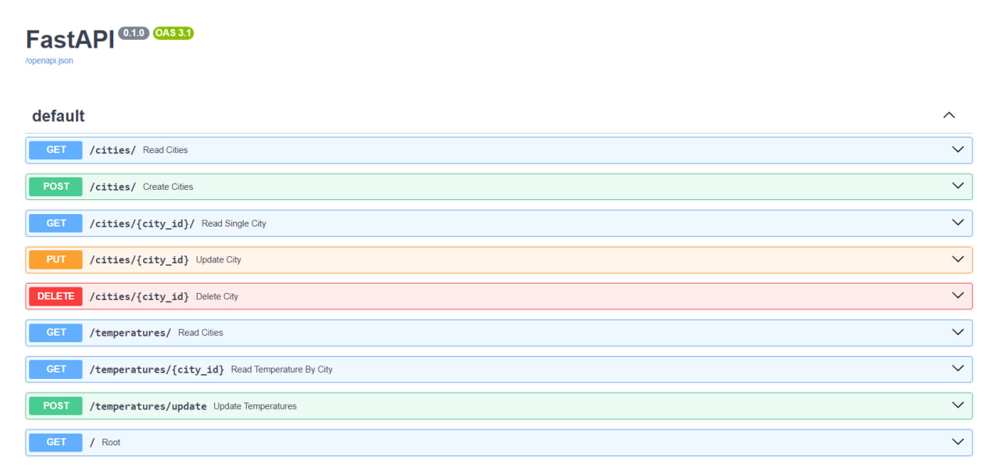

## Task Description

You are required to create a FastAPI application that manages city data and their corresponding temperature data. The application will have two main components (apps):

1. A CRUD (Create, Read, Update, Delete) API for managing city data.
2. An API that fetches current temperature data for all cities in the database and stores this data in the database. This API should also provide a list endpoint to retrieve the history of all temperature data.

### Part 1: City CRUD API

1. Create a new FastAPI application.
2. Define a Pydantic model `City` with the following fields:
    - `id`: a unique identifier for the city.
    - `name`: the name of the city.
    - `additional_info`: any additional information about the city.
3. Implement a SQLite database using SQLAlchemy and create a corresponding `City` table.
4. Implement the following endpoints:
    - `POST /cities`: Create a new city.
    - `GET /cities`: Get a list of all cities.
    - **Optional**: `GET /cities/{city_id}`: Get the details of a specific city.
    - **Optional**: `PUT /cities/{city_id}`: Update the details of a specific city.
    - `DELETE /cities/{city_id}`: Delete a specific city.

### Part 2: Temperature API

1. Define a Pydantic model `Temperature` with the following fields:
    - `id`: a unique identifier for the temperature record.
    - `city_id`: a reference to the city.
    - `date_time`: the date and time when the temperature was recorded.
    - `temperature`: the recorded temperature.
2. Create a corresponding `Temperature` table in the database.
3. Implement an endpoint `POST /temperatures/update` that fetches the current temperature for all cities in the database from an online resource of your choice. Store this data in the `Temperature` table. You should use an async function to fetch the temperature data.
4. Implement the following endpoints:
    - `GET /temperatures`: Get a list of all temperature records.
    - `GET /temperatures/?city_id={city_id}`: Get the temperature records for a specific city.

### Additional Requirements

- Use dependency injection where appropriate.
- Organize your project according to the FastAPI project structure guidelines.

## Evaluation Criteria

Your task will be evaluated based on the following criteria:

- Functionality: Your application should meet all the requirements outlined above.
- Code Quality: Your code should be clean, readable, and well-organized.
- Error Handling: Your application should handle potential errors gracefully.
- Documentation: Your code should be well-documented (README.md).

## Deliverables

Please submit the following:

- The complete source code of your application.
- A README file that includes:
    - Instructions on how to run your application.
    - A brief explanation of your design choices.
    - Any assumptions or simplifications you made.

Good luck!


#MY SOLUTION

#Py FastAPI City Temperature Management API
 This application is an API for managing city temperatures using FastAPI.

 # Installation
 # 1. Clone the repository:

 ```bash
git clone https://github.com/kostiukmkalne/py-fastapi-city-temperature-management-api.git

# 1. Navigate to the project directory:
   cd py-fastapi-city-temperature-management-api

# 2. Install dependencies:
   pip install -r requirements.txt
# Usage
# Creating a City:
   POST /cities/

Creates a new city with the provided data.
Example Request:
{
  "name": "New York",
  "additional_info": "Capital city of the United States"
}

Example Response:
{
  "id": 1,
  "name": "New York",
  "additional_info": "Capital city of the United States"
}

# Getting a List of Cities

GET /cities/

Retrieves a list of cities with optional pagination.

Example Response:

[
  {
    "id": 1,
    "name": "New York",
    "additional_info": "Capital city of the United States"
  },
  {
    "id": 2,
    "name": "Los Angeles",
    "additional_info": "City in California"
  }
]


# Getting a City by ID

GET /cities/{city_id}

Retrieves a city by its identifier.

Example Response:

{
  "id": 1,
  "name": "New York",
  "additional_info": "Capital city of the United States"
}


# Deleting a City by ID

DELETE /cities/{city_id}

Deletes a city by its identifier.

Example Response:

{
  "detail": "City deleted"
}

created in pain but with inspiration)))
