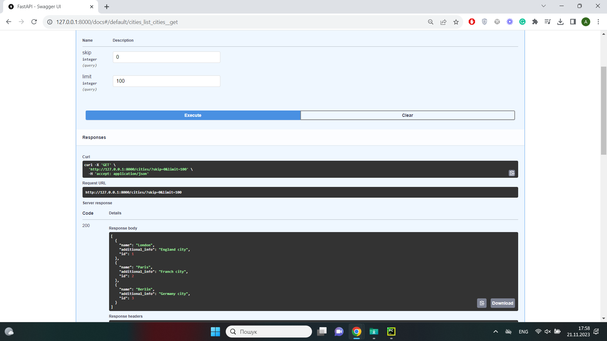
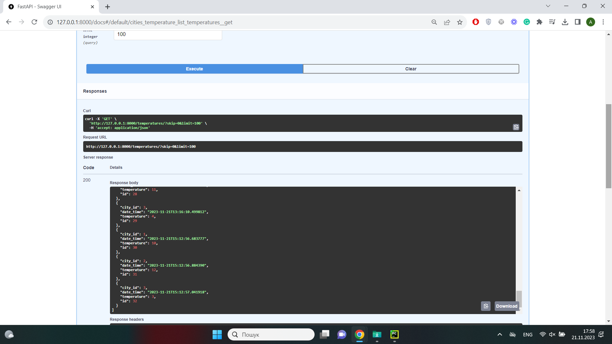
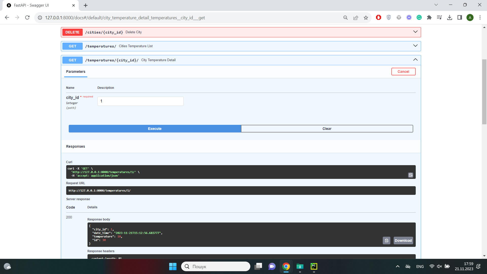
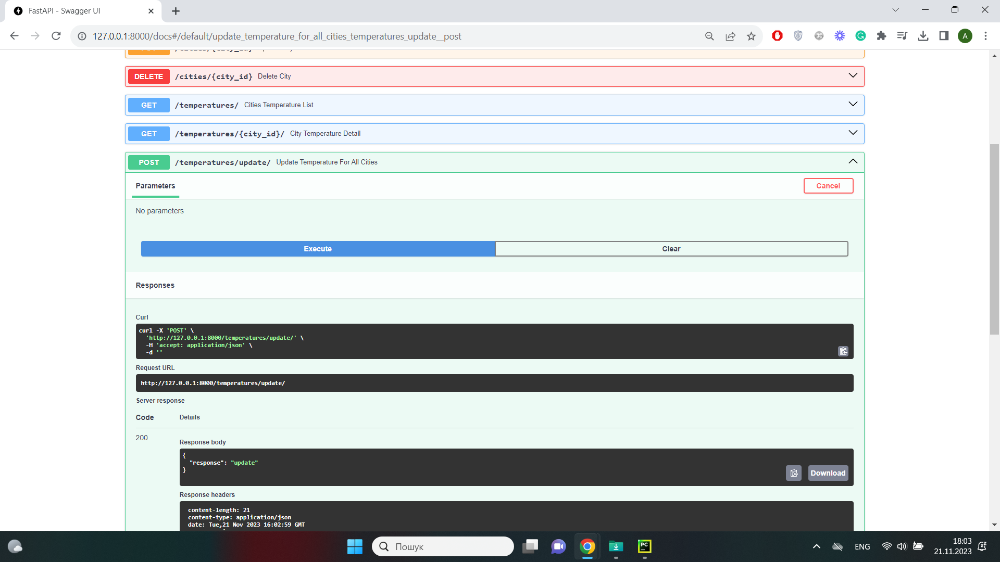

# City temperature management FastAPI

The City temperature management FastAPI shows the current temperature for added cities.
The system comprises two primary modules:
1. A CRUD (Create, Read, Update, Delete) API for managing city data.
2. An API that fetches current temperature data for all cities in the database and stores this data in 
the database. This API should also provide a list endpoint to retrieve the history of all temperature data.

## Getting Started

### Prerequisites

Before you begin, make sure you have the following tools 
and technologies installed:

- Python (>=3.11)

## Installing:

1. Using Git:

```
git clone https://github.com/yourusername/your-fastapi-weather-api.git
python -m venv venv
source venv/bin/activate # for MacOS
venv\Scripts\activate # for Windows
pip install -r requirements.txt
```

2. You can open project in IDE and configure .env file using 
[.env.sample](./.env.sample) file as an example.

<details>
  <summary>Parameters for .env file:</summary>
  
  - WEATHER_API_KEY: ```Sign in at https://www.weatherapi.com/, 
generate an API Key.```
</details>

3. Initialize and run migrations:

```
alembic init alembic
alembic revision -m "{your massege}"
alembic upgrade head
```

4. Run server

```
uvicorn main:app --reload
```

## API Endpoints

<details>
  <summary>City</summary>

- Create new city: ```POST /cities/```
- Cities list: ```GET /cities/```
- Detail city: ```GET /cities/{city_id}/```
- Update city: ```PUT /cities/{city_id}/```
- Delete city: ```DELETE /cities/{city_id}/```
</details>

<details>
  <summary>Temperature</summary>

- List temperatures for all cities: ```GET /temperatures/```
- Detail actual temperature for city: ```GET /temperatures/{city_id}/```
- Update actual temperature for all cities: ```POST /temperatures/update/```
</details>

## Documentation

- Access the API documentation by running the server and 
navigating to http://localhost:8000/docs/


## Endpoints





