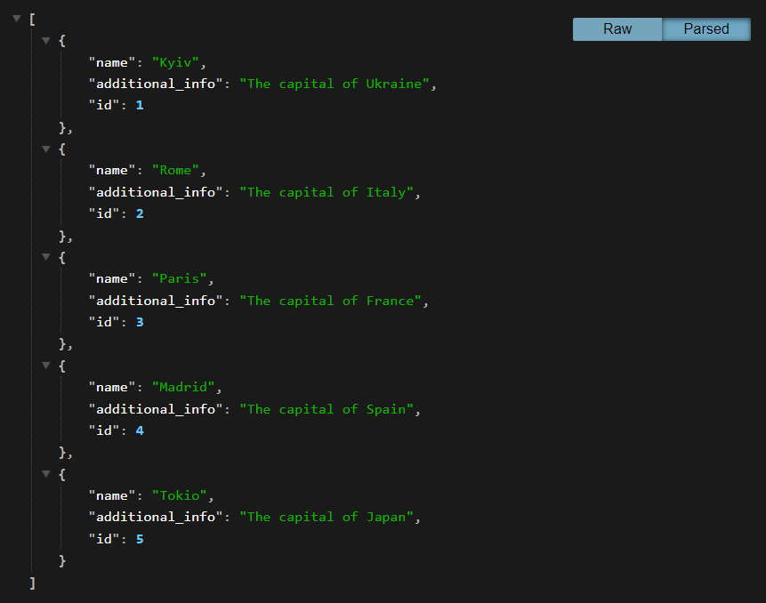

## City Temperature Management API

The FastAPI application that manages city data and their corresponding temperature data.
As the application has a lot of input/output (I/O) blocking operations 
such as requests to the Weather API and database operations functionalities are implemented in 
asynchronous mode.

<hr>

The application has two main components (apps):

1. A CRUD (Create, Read, Update, Delete) API for managing city data.
2. An API that fetches current temperature data for all cities in the database, stores this data in the database 
and provides a list endpoint to retrieve the history of all temperature data.

<hr>

## Technologies

- [FastApi Official Documentation](https://fastapi.tiangolo.com)
<br>FastAPI is a modern, fast (high-performance), web framework for building APIs 
with Python 3.7+ based on standard Python type hints. 
In this project, it's used to create the backend service. 
This service builds the FastAPI application and exposes it on port 8000.


- [SQLAlchemy Official Documentation](https://www.sqlalchemy.org)
<br>SQLAlchemy is the Python SQL toolkit and 
Object Relational Mapper that gives application developers the full power and flexibility of SQL.


- [Alembic Official Documentation](https://alembic.sqlalchemy.org/en/latest/)
<br>Alembic is a lightweight database migration tool for usage with the SQLAlchemy Database Toolkit for Python.

<hr>


## Prerequisites

1. Make sure you have Docker and Docker Compose installed on your system. 
You can check the installation instructions [here for Docker](https://docs.docker.com/get-docker/) 
and [here for Docker Compose](https://docs.docker.com/compose/install/).

<hr>

## Setup

Build and run the Docker containers:
```
docker-compose up -d --build
```

<hr>

## Accessing the Application

### Documentation is accessible at:
1. `http://localhost:8000/docs/`

### API
1. City Temperature Management API Service is accessible at `http://localhost:8000/`
2. Page for city list is available at `http://localhost:8000/cities/`
3. The detailed page for a city resource is available at `http://localhost:8000/cities/{city_id}/`
4. Page for temperature list is available at `http://localhost:8000/temperatures/`

<hr>

## Shutdown

1. To stop running server use CTRL-C

<hr>

## Demo





<hr>

Remember to replace `localhost` with the relevant IP address if you're not accessing these 
from the same machine where the services are running.

<br>
Please make sure to replace placeholders with your actual values in the `.env` file. 

<hr>
